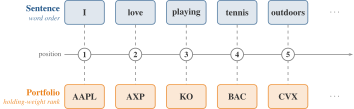
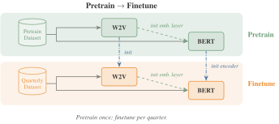

# AssetEmbeddingsInChina

> Learning asset embeddings from partial institutional holdings in China's A-share market.
> Companion training code for the working paper "Do Asset Embeddings Need Complete Holdings? Lessons from China" (2026).

[](LICENSE)
[](pyproject.toml)
[](https://doi.org/10.5281/zenodo.20640781)

## The setting

China's A-share market is institutionally distinct: retail investors dominate trading volume, institutional holdings account for only ~20% of floating shares, and the disclosure regime alternates between fully observed (semi-annual / annual) and partially observed (quarterly top-10) panels. Asset characteristics shift on quarterly horizons under industrial-policy and regulatory cycles. Whether asset embeddings need complete holdings to work — or whether the partial panels China actually discloses are enough — is the question the companion paper answers; this repository provides the training pipeline that learns the embeddings.

Following Gabaix et al. (2025), we extract latent asset characteristics from institutional holdings: each investor's portfolio is a *sentence* and each stock is a *token*. Rank order carries economic meaning — the largest position is the primary exposure, smaller positions are supplementary — just as word order carries meaning in language.

<p align="center">
  
</p>

## What the paper does differently

The estimation departs from Gabaix et al. in two respects, and both answer one question: how can latent demand factors be estimated when holdings are only *partially observed*? China's hybrid disclosure rules act as a censoring filter on the true holdings, and the two departures are designed for exactly the places where that censoring binds.

**Pretrain–finetune instead of independent quarterly fits.** Embeddings fitted quarter by quarter are not directly comparable over time: the demand system identifies each quarter's solution only up to a rotation, so quarter-to-quarter differences need not represent true changes in the asset. Pretraining once on the first 80% of holding observations (chronological split, cutoff 2023Q1: 73 quarters for pretraining, 6 for quarterly fine-tuning) and initializing every quarterly fine-tune from that base makes the rotations more likely to agree across quarters. Pretraining learns the common, stable holding structure; finetuning captures the quarter-specific variations on top of it.

**Warm-starting BERT's embedding layer from Word2Vec.** At both the pretraining and fine-tuning stages, BERT's embedding layer starts from the trained Word2Vec embeddings rather than random vectors (cold-start). Under top-ten disclosure, many assets appear in only a handful of reported portfolios in Q1/Q3 — the warm-start gives exactly these thinly observed assets a sensible prior.

Without either departure, the performance of the BERT embeddings generally deteriorates; Gabaix et al. find pretraining unnecessary in the uniformly disclosed US market, and the paper shows this is not the case in China.

<p align="center">
  
</p>

## What the repository provides

- **Three model families** trained on institutional portfolios: `AssetBERT` (transformer MLM), `AssetW2V` (Skip-gram/CBOW), and `AssetRS` (PCA/ICA recommender-system baselines).
- **The pretrain–finetune pipeline** producing quarterly embedding sequences that are comparable over time.
- **A text-embedding pipeline** that builds LLM-based embeddings (OpenAI / Cohere / Voyage / Gemini / local HF models) from firm names, the paper's text-based comparison point.
- **The data pipeline** from raw CSMAR shareholding dumps to model-ready portfolio corpora, plus a config system and batch-generation tooling for reproducible experiment grids.

In the paper, the resulting embeddings outperform text embeddings, align with investor demand, and capture the state-ownership structure specific to the A-share market — and a controlled censoring experiment shows the top-ten disclosure rule China already imposes is enough for them to add value.

## Quickstart

```bash
git clone https://github.com/Initial-Singularity/AssetEmbeddingsInChina
cd AssetEmbeddingsInChina
uv sync --extra notebook                          # notebook + ipykernel are demo-only extras
uv run jupyter lab examples/quickstart.ipynb      # or: uv run python examples/quickstart.py
```

The notebook runs the full **W2V → BERT-PT → BERT-FT** training chain on a synthetic dataset shipped in `examples/data/` (CPU, ~1 minute) and produces three asset-embedding CSVs sharing one coordinate frame. Real production runs require CSMAR data; see [`docs/how-to/prepare-data.md`](docs/how-to/prepare-data.md).

## Data availability

The trained embeddings are archived on Zenodo under CC-BY-4.0:
**[10.5281/zenodo.20640781](https://doi.org/10.5281/zenodo.20640781)** (concept DOI — always resolves to the latest version).

- `asset_embeddings.tar.gz` — AssetBERT / AssetW2V / AssetRS per-stock embeddings at dimensions 4–128 for 2023Q2–2024Q3.
- `text_embeddings.tar.gz` — full-dimensional masters for the nine text embedders plus `regenerate.py`, which rebuilds any `language × transform × dimension × quarter` variant.

These are the *learned representations*, not CSMAR source data — download them directly without CSMAR access. See the deposit's own `README.md` for the schema and reproducibility notes. Reproducing the embeddings from raw data still requires CSMAR ([Prepare data](docs/how-to/prepare-data.md)).

## Citation

```bibtex
@unpublished{cheng2026asset,
  title  = {Do Asset Embeddings Need Complete Holdings? Lessons from China},
  author = {Cheng, Zitong and Huang, Dashan and Liu, Xiaobin and Zeng, Tao},
  year   = {2026},
  note   = {Working paper},
}

@dataset{cheng2026asset_data,
  title     = {Asset \& Text Embeddings for the China A-share Market},
  author    = {Cheng, Zitong and Huang, Dashan and Liu, Xiaobin and Zeng, Tao},
  year      = {2026},
  publisher = {Zenodo},
  doi       = {10.5281/zenodo.20640781},
}
```

(Corresponding author: Xiaobin Liu, `liuxb53@mail.sysu.edu.cn`.)

## Documentation

The full docs live in [`docs/`](docs/) and will be published at <https://initial-singularity.github.io/AssetEmbeddingsInChina/> once the repository is public.

- [Installation](docs/how-to/install.md)
- [Prepare data](docs/how-to/prepare-data.md)
- [Training](docs/how-to/train.md)
- [Text embeddings](docs/how-to/text-embeddings.md)
- [Method: paper ↔ code](docs/explanation/method.md)
- [Configuration system](docs/explanation/config-system.md)

## Contributing

See [CONTRIBUTING.md](CONTRIBUTING.md).

## License

MIT — see [LICENSE](LICENSE).
