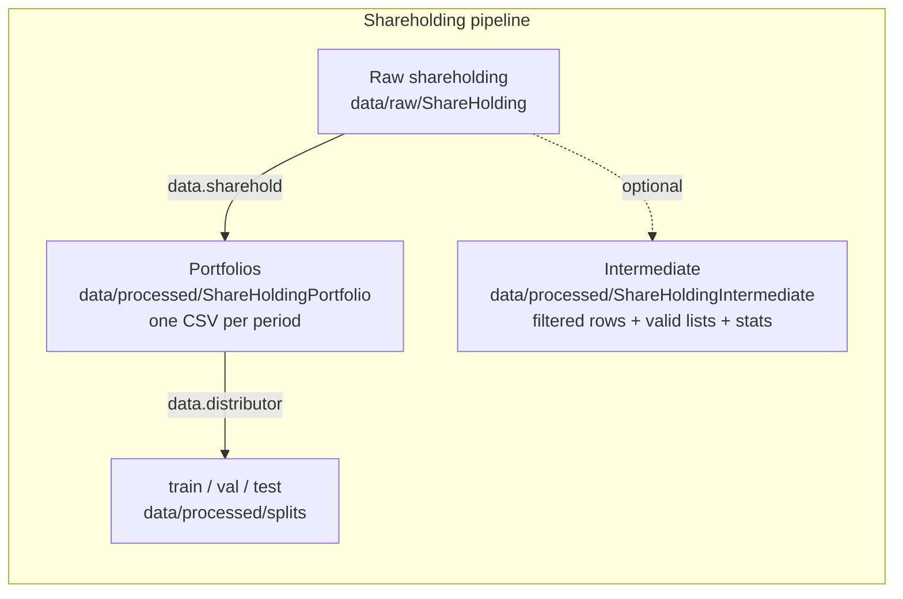

# Data pipeline

This document describes the AssetEmbeddings data-processing pipeline, including the data formats and processing scripts at each stage.

## Contents

- [Data flow overview](#data-flow-overview)
- [Raw data formats](#raw-data-formats)
- [asset_embeddings.scripts.data.sharehold processing](#asset_embeddingsscriptsdatasharehold-processing)
- [asset_embeddings.scripts.data.distributor data splitting](#asset_embeddingsscriptsdatadistributor-data-splitting)
- [Intermediate data format](#intermediate-data-format)
- [Training data format](#training-data-format)
- [End-to-end processing flow](#end-to-end-processing-flow)

---

## Data flow overview



---

## Raw data formats

### Shareholding data (CSMAR)

The raw CSV files live under `data/raw/ShareHolding/` (split by year: `2005.csv` … `2024.csv`), with a 16-column structure:

| Field | Type | Description |
|--------|------|------|
| `InstitutionID` | str | **Listed-company record code** (an internal CSMAR identifier, in a strict 1:1 bijection with `Symbol`) — **not** an institutional-investor ID. See [ID column semantics](#id-column-semantics) below |
| `Symbol` | str | Stock code (6 digits, leading zeros preserved) |
| `EndDate` | str | Reporting-period end date (e.g. `2023-06-30`) |
| `SystematicsID` | str | Institution-category code (P9401=fund / P9402=QFII / P9403=broker / …) |
| `Systematics` | str | Institution-category name |
| `ShareHolderID` | str | **The real, unique institutional-investor identifier** (e.g. BARCLAYS BANK PLC = `10100689`, stable across multiple stocks) |
| `ShareHolderName` | str | Institutional-investor name (GBK encoding) |
| `FundID` | str | Fund-product ID (empty in some rows; the empty rate rises from 2024 onward) |
| `CategoryCode` | str | Shareholder-category code (P2201–P2269) |
| `Holdshares` | float | Number of shares held |
| `HoldProportion` | float | Holding ratio (relative to total share capital, a **percentage 0–100**, not a fraction) |
| `HoldProportion1` | float | Holding ratio (relative to free-float A-shares, a **percentage 0–100**) |
| `Price` | float | Period-end stock price (the closing price nearest to `EndDate`) |
| `IndustryCode` | str | Industry code (CSRC 2012 classification) |
| `IndustryName` | str | Industry name |
| `Period` | str | Quarter label (a processing-stage product, e.g. `2023Q2`) |

#### ID column semantics

The semantics and naming of the two ID columns in the CSMAR holdings table are easy to confuse:

- **`ShareHolderID`** — **the real, global institutional-investor ID.** A single institution (such as Barclays Bank acting as a QFII, `ShareHolderID=10100689`) **keeps the same ID** across all stocks it holds; this is the correct grouping key for constructing a portfolio (a "sentence").
- **`InstitutionID`** — a **listed-company record code**, CSMAR's internal code for that listed company's holdings records, in a **strict 1:1 bijection with `Symbol`** (verified to hold across all 80 quarters). All holdings rows for the same stock share the same InstitutionID, regardless of the holding institution's identity. **It should not be used as an investor identifier.**

The `--source_shareholder_id_column` argument of `asset_embeddings.scripts.data.sharehold` defaults to `"ShareHolderID"`, which is the only correct setting for the project (see the [asset_embeddings.scripts.data.sharehold processing](#asset_embeddingsscriptsdatasharehold-processing) section below, or refer to the `SH-C2-09` primary-key fix recorded in PR #22 (data-audit)).

#### Primary key

`(ShareHolderID, Symbol)` is the unique primary key within a single-quarter CSV (100% verified across 80 quarters).

`(InstitutionID, Symbol)` is also unique, but because `InstitutionID ↔ Symbol` is 1:1, it is equivalent to `Symbol` being unique on its own — the research layer should not use it as a primary key.

#### Example

```csv
InstitutionID,Symbol,EndDate,SystematicsID,Systematics,ShareHolderID,ShareHolderName,...,HoldProportion,HoldProportion1,...
107574,600573,2023-06-30,P9401,基金持股,10596541,万泉河中证一带一路ETF...,...,0.01552,0.01552,...
107574,600573,2023-06-30,P9401,基金持股,509974749,中国工商银行...,...,0.69,0.69192,...
107574,600573,2023-06-30,P9401,基金持股,10396700,平安鑫诚混合型...,...,0.00572,0.00572,...
```

Note: the three rows above share the same `Symbol=600573` (→ the same `InstitutionID=107574`) but have different `ShareHolderID` values — these are records of the same stock being held by three different institutional investors.

---

## asset_embeddings.scripts.data.sharehold processing

### Overview

`asset_embeddings.scripts.data.sharehold` is the project's shareholding-data processing module. It runs the following steps:

1. **Data loading** (`ShareholdingLoader`): read the CSV files and group them by time period
2. **Data aggregation** (`ShareholdingAggregator`): handle duplicate records within the same period
3. **Data filtering** (`ShareholdingFilter`): filter out low-frequency investors and stocks
4. **Portfolio generation** (`PortfolioGenerator`): produce the portfolio format
5. **Data saving** (`PortfolioSaver`): write the final and intermediate data

### Command-line arguments

```bash
uv run python -m asset_embeddings.scripts.data.sharehold \
    --input_folder data/raw/ShareHolding \
    --output_folder data/processed/ShareHoldingPortfolio \
    --intermediate_folder data/processed/ShareHoldingIntermediate \
    --output_format csv \
    --frequency Q \
    --aggregation last \
    --include_proportion true \
    --investor_lowerbound 10 \
    --stock_lowerbound 10 \
    --verbose true
```

#### Key arguments

| Argument | Default | Description |
|------|--------|------|
| `--frequency` | `Q` | Grouping frequency: Y (year), HY (half-year), Q (quarter), M (month), N (no grouping) |
| `--aggregation` | `all` | Aggregation strategy: all, last, first, max, mean |
| `--include_proportion` | `false` | Whether to include holding ratios |
| `--investor_lowerbound` | `10` | Minimum number of holdings per investor |
| `--stock_lowerbound` | `10` | Minimum number of times a stock must be held |

> This lists the key flags only. See the [CLI reference](../reference/cli.md#data-sharehold) for the complete argument table.

### Frequency mapping

| Frequency | Grouping | Output example |
|------|----------|----------|
| Y | by year | `2023.csv`, `2024.csv` |
| HY | half-year | `2023H1.csv`, `2023H2.csv` |
| Q | quarter | `2023Q1.csv`, `2023Q2.csv` |
| M | month | `2023-01.csv`, `2023-02.csv` |
| N | no grouping | `all.csv` |

### Aggregation strategies

| Strategy | Description |
|------|------|
| `all` | Keep all records (no aggregation) |
| `last` | Keep the record with the latest date |
| `first` | Keep the record with the earliest date |
| `max` | Keep the record with the largest holding ratio |
| `mean` | Average the holding ratios |

---

## asset_embeddings.scripts.data.distributor data splitting

### Overview

`asset_embeddings.scripts.data.distributor` is a **general-purpose data-splitting tool** that can split any tabular data into train/val/test sets.

### Features

- **File-level splitting**: preserve file integrity, assigning whole files to each split
- **Row-level splitting**: cross file boundaries, splitting exactly by row
- **Multiple strategies**: concat (load into memory) or streaming
- **Portfolio support**: built-in `PortfolioDataEncoder` support

### Command-line arguments

```bash
uv run python -m asset_embeddings.scripts.data.distributor \
    --input_path data/processed/ShareHoldingPortfolio \
    --output_path data/processed/splits \
    --split_ratios 0.8 0.1 0.1 \
    --dir_names train val test \
    --keep_file_integrity true \
    --file_format csv \
    --seed 42
```

#### Key arguments

| Argument | Default | Description |
|------|--------|------|
| `--split_ratios` | `[0.8, 0.2]` | Split ratios (normalized automatically) |
| `--dir_names` | `split_0, split_1, ...` | Output directory names |
| `--keep_file_integrity` | `true` | Whether to preserve file integrity |
| `--strategy` | `concat` | Row-level splitting strategy |
| `--split_shuffle` | `true` | Whether to shuffle before row-level splitting |
| `--use_portfolio_encoder` | `false` | Use the Portfolio encoder |

> This lists the key flags only. See the [CLI reference](../reference/cli.md#data-distributor) for the complete argument table.

### Splitting strategies

#### File-level splitting (`keep_file_integrity=true`)

Preserves each file's integrity and assigns whole files to each split by total row count:

```
Input:  file1.csv (1000 rows), file2.csv (500 rows), file3.csv (800 rows)
Ratios: 0.7 / 0.3

Result:
  train/: file1.csv, file2.csv (1500 rows, 65%)
  test/:  file3.csv (800 rows, 35%)
```

#### Row-level splitting — Concat (`keep_file_integrity=false, strategy=concat`)

Loads all files into memory, concatenates them, then splits by row:

```python
# pseudocode
all_data = pd.concat([read(f) for f in files])
if shuffle:
    all_data = all_data.sample(frac=1)
split_and_save(all_data, ratios)
```

Use case: small-to-medium datasets that need exact row-level splitting

#### Row-level splitting — Streaming (`keep_file_integrity=false, strategy=streaming`)

Processes the data as a stream, assigning each row to a split one at a time:

```python
# pseudocode
for file in files:
    for row in read_rows(file):
        target_split = get_next_split()
        write_to_split(row, target_split)
```

Use case: very large datasets under memory constraints

### Using the config class

```python
from asset_embeddings.scripts.data.distributor import DistributionConfig, DatasetDistributor
from asset_embeddings.configs import LoggerConfig
from asset_embeddings.preparers import Logger_Preparer

config = DistributionConfig(
    input_path="data/processed/ShareHoldingPortfolio",
    output_path="data/processed/splits",
    split_ratios=[0.8, 0.1, 0.1],
    dir_names=["train", "val", "test"],
    keep_file_integrity=False,
    strategy="concat",
    split_shuffle=True,
    seed=42
)

logger = Logger_Preparer().set_config(
    LoggerConfig(log_name="Distributor")
).prepare()

distributor = DatasetDistributor(config, logger)
distributor.distribute()
```

---

## Intermediate data format

When you pass the `--intermediate_folder` argument, `asset_embeddings.scripts.data.sharehold` writes its intermediate processing results.

### Directory structure

```
data/processed/ShareHoldingIntermediate/
├── 2023Q1/
│   ├── 2023Q1.csv           # filtered source rows (all CSMAR columns + Period)
│   ├── valid_investors.json # valid investor list
│   ├── valid_stocks.json    # valid stock list
│   ├── statistics.json      # descriptive stats (with --stats, default true)
│   └── stock_coverage.csv   # per-stock institutional coverage (with --stats)
├── 2023Q2/
│   └── ...
└── summary.json             # per-period summary
```

### 2023Q1.csv format

The filtered source rows — every original CSMAR column, plus a `Period` label. The string columns
(`Systematics`, `ShareHolderName`, `IndustryName`) carry Chinese labels in the source; they are elided
below:

```csv
InstitutionID,Symbol,EndDate,SystematicsID,Systematics,ShareHolderID,ShareHolderName,FundID,CategoryCode,Holdshares,HoldProportion,HoldProportion1,Price,IndustryCode,IndustryName,Period
101704,000001,2023-03-31,P9405,<category>,50107644,<investor>,,P2244,65029587.0,0.34,0.335105,16.45,J66,<industry>,2023Q1
```

### valid_investors.json

```json
["INV001", "INV002", "INV003", ...]
```

### valid_stocks.json

```json
["000001", "000002", "600000", ...]
```

### statistics.json (with `--stats true`)

```json
{
    "portfolio_length": {
        "mean": 15.3,
        "median": 12.0,
        "std": 8.5,
        "min": 10,
        "max": 156,
        "quantiles": {
            "25%": 10.0,
            "50%": 12.0,
            "75%": 18.0,
            "90%": 28.0,
            "95%": 42.0,
            "99%": 78.0
        }
    },
    "stock_frequency": {
        "mean": 45.2,
        "median": 32.0,
        "std": 56.3,
        "min": 10,
        "max": 523,
        "quantiles": { ... }
    }
}
```

### summary.json

```json
{
    "2023Q1": {
        "valid_investors": 1523,
        "valid_stocks": 3856,
        "samples": 45623
    },
    "2023Q2": {
        "valid_investors": 1589,
        "valid_stocks": 3912,
        "samples": 48156
    }
}
```

---

## Training data format

### Directory structure

```
data/processed/ShareHoldingPortfolio/
├── 2023Q1.csv   (or .json / .binary)
├── 2023Q2.csv
└── ...
```

### CSV format (include_proportion=false)

`Portfolio` is a bare comma-joined string of symbols (sorted by `Proportion1` descending), quoted as one CSV field:

```csv
InvestorID,Portfolio
10101912,"000001,000002,600000"
10102802,"000858,601318,000651"
```

### CSV format (include_proportion=true)

`Proportion1` (vs total shares) and `Proportion2` (vs tradable A-shares) are comma-joined, row-aligned with `Portfolio`, at 6-decimal precision:

```csv
InvestorID,Portfolio,Proportion1,Proportion2
10101912,"000001,000002,600000","0.052300,0.023400,0.015600","0.081200,0.035600,0.024500"
10102802,"000858,601318,000651","0.031200,0.025600,0.018900","0.048900,0.039800,0.029500"
```

### JSON format

```json
[
    {
        "InvestorID": "INV001",
        "Portfolio": ["000001", "000002", "600000"],
        "Proportion1": [0.0523, 0.0234, 0.0156],
        "Proportion2": [0.0812, 0.0356, 0.0245]
    },
    {
        "InvestorID": "INV002",
        "Portfolio": ["000858", "601318", "000651"],
        "Proportion1": [0.0312, 0.0256, 0.0189],
        "Proportion2": [0.0489, 0.0398, 0.0295]
    }
]
```

### Structure after splitting

```
data/processed/splits/
├── train/
│   ├── 2023Q1.csv
│   ├── 2023Q2.csv
│   └── ...
├── val/
│   └── ...
└── test/
    └── ...
```

---

## End-to-end processing flow

### 1. Process the shareholding data

```bash
# Generate quarterly portfolio data
uv run python -m asset_embeddings.scripts.data.sharehold \
    -i data/raw/ShareHolding \
    -o data/processed/ShareHoldingPortfolio \
    -inter data/processed/ShareHoldingIntermediate \
    --frequency Q \
    --aggregation last \
    --include_proportion true \
    --investor_lowerbound 10 \
    --stock_lowerbound 10 \
    -v true \
    -l logs/data_sharehold.log
```

### 2. Split the training data

```bash
# File-level split: whole per-quarter files are assigned to train/val/test
uv run python -m asset_embeddings.scripts.data.distributor \
    -i data/processed/ShareHoldingPortfolio \
    -o data/processed/splits \
    --split_ratios 0.8 0.1 0.1 \
    --dir_names train val test \
    --keep_file_integrity true

# Row-level split (cross-file), decoding the portfolio encoding first
uv run python -m asset_embeddings.scripts.data.distributor \
    -i data/processed/ShareHoldingPortfolio \
    -o data/processed/splits \
    --split_ratios 0.8 0.1 0.1 \
    --dir_names train val test \
    --keep_file_integrity false \
    --strategy concat \
    --use_portfolio_encoder true \
    --include_proportion true
```

### 3. Verify the data

```bash
# Check the output directories
ls -la data/processed/splits/train/
ls -la data/processed/splits/val/
ls -la data/processed/splits/test/

# Check the data format
head data/processed/splits/train/2023Q1.csv
```

---

## Custom processing

### Custom Period mapping

```python
from asset_embeddings.scripts.data.sharehold import ShareholdingLoader, PeriodMapperFunc

def custom_period_mapper(dt: pd.Timestamp) -> str:
    """Custom fiscal-year mapping (starts in April)"""
    if dt.month >= 4:
        return f"FY{dt.year}"
    else:
        return f"FY{dt.year - 1}"

loader = ShareholdingLoader(
    logger=logger,
    data_folder="data/raw/ShareHolding",
    frequency=custom_period_mapper  # pass in the custom function
)
```

### Using PortfolioDataEncoder

```python
from asset_embeddings.datasets import PortfolioDataEncoder

# Encode
encoder = PortfolioDataEncoder(
    format="csv",
    id_key="InvestorID",
    portfolio_key="Portfolio",
    proportion1_key="Proportion1",
    proportion2_key="Proportion2"
)

# Save
encoder.encode(df, "output/portfolios", include_proportion=True)

# Read
df = encoder.decode("output/portfolios.csv", include_proportion=True)
```
