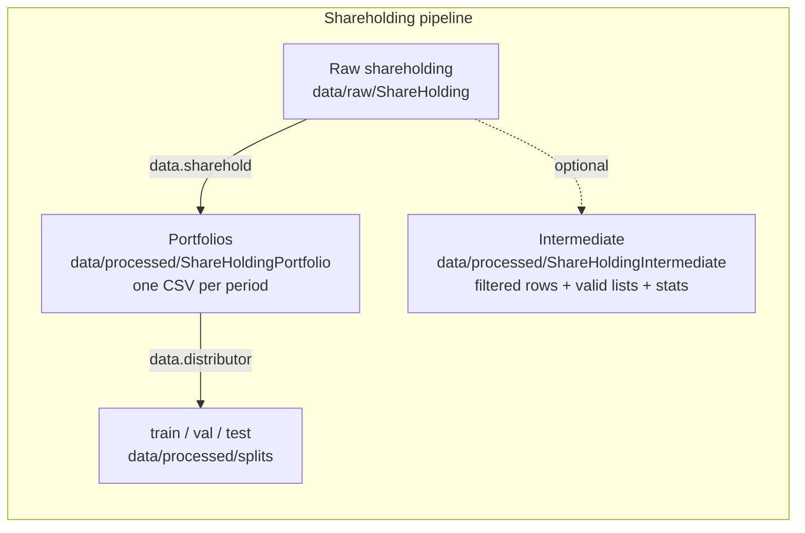

# 数据流水线

本文档介绍 AssetEmbeddings 的数据处理流水线，包括各阶段的数据格式与处理脚本。

## 目录

- [数据流概览](#数据流概览)
- [原始数据格式](#原始数据格式)
- [asset_embeddings.scripts.data.sharehold 处理](#asset_embeddingsscriptsdatasharehold-处理)
- [asset_embeddings.scripts.data.distributor 数据切分](#asset_embeddingsscriptsdatadistributor-数据切分)
- [中间数据格式](#中间数据格式)
- [训练数据格式](#训练数据格式)
- [端到端处理流程](#端到端处理流程)

---

## 数据流概览



---

## 原始数据格式

### 持股数据（CSMAR）

原始 CSV 文件位于 `data/raw/ShareHolding/`（按年份拆分：`2005.csv` … `2024.csv`），16 列结构：

| 字段 | 类型 | 说明 |
|--------|------|------|
| `InstitutionID` | str | **上市公司记录代码**（CSMAR 内部标识符，与 `Symbol` 严格一一对应）——**不是**机构投资者 ID。参见下文 [ID 列语义](#id-列语义) |
| `Symbol` | str | 股票代码（6 位，保留前导零） |
| `EndDate` | str | 报告期截止日（如 `2023-06-30`） |
| `SystematicsID` | str | 机构类别代码（P9401=基金 / P9402=QFII / P9403=券商 / …） |
| `Systematics` | str | 机构类别名称 |
| `ShareHolderID` | str | **真实、唯一的机构投资者标识符**（如 BARCLAYS BANK PLC = `10100689`，跨多只股票稳定不变） |
| `ShareHolderName` | str | 机构投资者名称（GBK 编码） |
| `FundID` | str | 基金产品 ID（部分行为空；2024 年起空值率上升） |
| `CategoryCode` | str | 股东类别代码（P2201–P2269） |
| `Holdshares` | float | 持股数量 |
| `HoldProportion` | float | 持股比例（相对总股本，是 **0–100 的百分数**，不是小数） |
| `HoldProportion1` | float | 持股比例（相对流通 A 股，是 **0–100 的百分数**） |
| `Price` | float | 期末股价（最接近 `EndDate` 的收盘价） |
| `IndustryCode` | str | 行业代码（证监会 2012 分类） |
| `IndustryName` | str | 行业名称 |
| `Period` | str | 季度标签（处理阶段的产物，如 `2023Q2`） |

#### ID 列语义

CSMAR 持股表中两个 ID 列的语义与命名容易混淆：

- **`ShareHolderID`** —— **真实、全局的机构投资者 ID。** 同一家机构（如以 QFII 身份出现的巴克莱银行，`ShareHolderID=10100689`）在它持有的所有股票上**保持相同的 ID**；这是构造组合（“句子”）的正确分组键。
- **`InstitutionID`** —— 一个**上市公司记录代码**，是 CSMAR 为该上市公司持股记录设的内部代码，**与 `Symbol` 严格一一对应**（经验证在全部 80 个季度成立）。同一只股票的所有持股行共享相同的 InstitutionID，与持有机构身份无关。**不应把它用作投资者标识符。**

`asset_embeddings.scripts.data.sharehold` 的 `--source_shareholder_id_column` 参数默认为 `"ShareHolderID"`，这是本项目唯一正确的设置（见下文 [asset_embeddings.scripts.data.sharehold 处理](#asset_embeddingsscriptsdatasharehold-处理) 一节，或参阅 PR #22（data-audit）中记录的 `SH-C2-09` 主键修复）。

#### 主键

`(ShareHolderID, Symbol)` 是单季度 CSV 内的唯一主键（在 80 个季度上 100% 验证）。

`(InstitutionID, Symbol)` 也唯一，但因为 `InstitutionID ↔ Symbol` 是 1:1，它等价于 `Symbol` 自身唯一——研究层不应把它当主键。

#### 示例

```csv
InstitutionID,Symbol,EndDate,SystematicsID,Systematics,ShareHolderID,ShareHolderName,...,HoldProportion,HoldProportion1,...
107574,600573,2023-06-30,P9401,基金持股,10596541,万泉河中证一带一路ETF...,...,0.01552,0.01552,...
107574,600573,2023-06-30,P9401,基金持股,509974749,中国工商银行...,...,0.69,0.69192,...
107574,600573,2023-06-30,P9401,基金持股,10396700,平安鑫诚混合型...,...,0.00572,0.00572,...
```

注意：上面三行共享同一 `Symbol=600573`（→ 同一 `InstitutionID=107574`），但 `ShareHolderID` 不同——这是同一只股票被三个不同机构投资者持有的记录。

---

## asset_embeddings.scripts.data.sharehold 处理

### 概述

`asset_embeddings.scripts.data.sharehold` 是项目的持股数据处理模块。它执行以下步骤：

1. **数据加载**（`ShareholdingLoader`）：读取 CSV 文件并按时间段分组
2. **数据聚合**（`ShareholdingAggregator`）：处理同一期内的重复记录
3. **数据过滤**（`ShareholdingFilter`）：过滤低频投资者与股票
4. **组合生成**（`PortfolioGenerator`）：产出组合格式
5. **数据保存**（`PortfolioSaver`）：写出最终与中间数据

### 命令行参数

```bash
uv run python -m asset_embeddings.scripts.data.sharehold \
    --input_folder data/raw/ShareHolding \
    --output_folder data/processed/ShareHoldingPortfolio \
    --intermediate_folder data/processed/ShareHoldingIntermediate \
    --output_format csv \
    --frequency Q \
    --aggregation last \
    --include_proportion true \
    --investor_lowerbound 10 \
    --stock_lowerbound 10 \
    --verbose true
```

#### 关键参数

| 参数 | 默认值 | 说明 |
|------|--------|------|
| `--frequency` | `Q` | 分组频率：Y（年）、HY（半年）、Q（季）、M（月）、N（不分组） |
| `--aggregation` | `all` | 聚合策略：all、last、first、max、mean |
| `--include_proportion` | `false` | 是否包含持股比例 |
| `--investor_lowerbound` | `10` | 每个投资者的最少持股数 |
| `--stock_lowerbound` | `10` | 一只股票最少被持有的次数 |

> 此处仅列出关键参数。完整参数表见 [CLI 参考](../reference/cli.md#data-sharehold)。

### 频率映射

| 频率 | 分组 | 输出示例 |
|------|----------|----------|
| Y | 按年 | `2023.csv`、`2024.csv` |
| HY | 半年 | `2023H1.csv`、`2023H2.csv` |
| Q | 季 | `2023Q1.csv`、`2023Q2.csv` |
| M | 月 | `2023-01.csv`、`2023-02.csv` |
| N | 不分组 | `all.csv` |

### 聚合策略

| 策略 | 说明 |
|------|------|
| `all` | 保留全部记录（不聚合） |
| `last` | 保留日期最晚的记录 |
| `first` | 保留日期最早的记录 |
| `max` | 保留持股比例最大的记录 |
| `mean` | 对持股比例求平均 |

---

## asset_embeddings.scripts.data.distributor 数据切分

### 概述

`asset_embeddings.scripts.data.distributor` 是一个**通用数据切分工具**，可把任意表格数据切分为训练/验证/测试集。

### 特性

- **文件级切分**：保持文件完整性，把整个文件分配到各切分
- **行级切分**：跨文件边界，精确按行切分
- **多种策略**：concat（载入内存）或 streaming
- **组合支持**：内置 `PortfolioDataEncoder` 支持

### 命令行参数

```bash
uv run python -m asset_embeddings.scripts.data.distributor \
    --input_path data/processed/ShareHoldingPortfolio \
    --output_path data/processed/splits \
    --split_ratios 0.8 0.1 0.1 \
    --dir_names train val test \
    --keep_file_integrity true \
    --file_format csv \
    --seed 42
```

#### 关键参数

| 参数 | 默认值 | 说明 |
|------|--------|------|
| `--split_ratios` | `[0.8, 0.2]` | 切分比例（自动归一化） |
| `--dir_names` | `split_0, split_1, ...` | 输出目录名 |
| `--keep_file_integrity` | `true` | 是否保持文件完整性 |
| `--strategy` | `concat` | 行级切分策略 |
| `--split_shuffle` | `true` | 行级切分前是否打乱 |
| `--use_portfolio_encoder` | `false` | 使用 Portfolio 编码器 |

> 此处仅列出关键参数。完整参数表见 [CLI 参考](../reference/cli.md#data-distributor)。

### 切分策略

#### 文件级切分（`keep_file_integrity=true`）

保持每个文件的完整性，按总行数把整个文件分配到各切分：

```
输入：  file1.csv (1000 行)、file2.csv (500 行)、file3.csv (800 行)
比例： 0.7 / 0.3

结果：
  train/: file1.csv, file2.csv (1500 行, 65%)
  test/:  file3.csv (800 行, 35%)
```

#### 行级切分 —— Concat（`keep_file_integrity=false, strategy=concat`）

把所有文件载入内存、拼接，再按行切分：

```python
# 伪代码
all_data = pd.concat([read(f) for f in files])
if shuffle:
    all_data = all_data.sample(frac=1)
split_and_save(all_data, ratios)
```

适用场景：需要精确行级切分的中小数据集

#### 行级切分 —— Streaming（`keep_file_integrity=false, strategy=streaming`）

把数据当作流处理，逐行分配到各切分：

```python
# 伪代码
for file in files:
    for row in read_rows(file):
        target_split = get_next_split()
        write_to_split(row, target_split)
```

适用场景：内存受限下的超大数据集

### 使用配置类

```python
from asset_embeddings.scripts.data.distributor import DistributionConfig, DatasetDistributor
from asset_embeddings.configs import LoggerConfig
from asset_embeddings.preparers import Logger_Preparer

config = DistributionConfig(
    input_path="data/processed/ShareHoldingPortfolio",
    output_path="data/processed/splits",
    split_ratios=[0.8, 0.1, 0.1],
    dir_names=["train", "val", "test"],
    keep_file_integrity=False,
    strategy="concat",
    split_shuffle=True,
    seed=42
)

logger = Logger_Preparer().set_config(
    LoggerConfig(log_name="Distributor")
).prepare()

distributor = DatasetDistributor(config, logger)
distributor.distribute()
```

---

## 中间数据格式

当你传入 `--intermediate_folder` 参数时，`asset_embeddings.scripts.data.sharehold` 会写出其中间处理结果。

### 目录结构

```
data/processed/ShareHoldingIntermediate/
├── 2023Q1/
│   ├── 2023Q1.csv           # 过滤后的源行（所有 CSMAR 列 + Period）
│   ├── valid_investors.json # 有效投资者列表
│   ├── valid_stocks.json    # 有效股票列表
│   ├── statistics.json      # 描述性统计（--stats，默认 true）
│   └── stock_coverage.csv   # 逐股票机构覆盖（--stats）
├── 2023Q2/
│   └── ...
└── summary.json             # 逐期摘要
```

### 2023Q1.csv 格式

过滤后的源行——每个原始 CSMAR 列，加一个 `Period` 标签。字符串列（`Systematics`、`ShareHolderName`、`IndustryName`）在源数据中带中文标签；下面省略：

```csv
InstitutionID,Symbol,EndDate,SystematicsID,Systematics,ShareHolderID,ShareHolderName,FundID,CategoryCode,Holdshares,HoldProportion,HoldProportion1,Price,IndustryCode,IndustryName,Period
101704,000001,2023-03-31,P9405,<category>,50107644,<investor>,,P2244,65029587.0,0.34,0.335105,16.45,J66,<industry>,2023Q1
```

### valid_investors.json

```json
["INV001", "INV002", "INV003", ...]
```

### valid_stocks.json

```json
["000001", "000002", "600000", ...]
```

### statistics.json（`--stats true`）

```json
{
    "portfolio_length": {
        "mean": 15.3,
        "median": 12.0,
        "std": 8.5,
        "min": 10,
        "max": 156,
        "quantiles": {
            "25%": 10.0,
            "50%": 12.0,
            "75%": 18.0,
            "90%": 28.0,
            "95%": 42.0,
            "99%": 78.0
        }
    },
    "stock_frequency": {
        "mean": 45.2,
        "median": 32.0,
        "std": 56.3,
        "min": 10,
        "max": 523,
        "quantiles": { ... }
    }
}
```

### summary.json

```json
{
    "2023Q1": {
        "valid_investors": 1523,
        "valid_stocks": 3856,
        "samples": 45623
    },
    "2023Q2": {
        "valid_investors": 1589,
        "valid_stocks": 3912,
        "samples": 48156
    }
}
```

---

## 训练数据格式

### 目录结构

```
data/processed/ShareHoldingPortfolio/
├── 2023Q1.csv   (或 .json / .binary)
├── 2023Q2.csv
└── ...
```

### CSV 格式（include_proportion=false）

`Portfolio` 是裸的、用逗号连接的股票代码串（按 `Proportion1` 降序排序），作为单个 CSV 字段加引号：

```csv
InvestorID,Portfolio
10101912,"000001,000002,600000"
10102802,"000858,601318,000651"
```

### CSV 格式（include_proportion=true）

`Proportion1`（相对总股本）与 `Proportion2`（相对流通 A 股）用逗号连接，与 `Portfolio` 逐行对齐，保留 6 位小数：

```csv
InvestorID,Portfolio,Proportion1,Proportion2
10101912,"000001,000002,600000","0.052300,0.023400,0.015600","0.081200,0.035600,0.024500"
10102802,"000858,601318,000651","0.031200,0.025600,0.018900","0.048900,0.039800,0.029500"
```

### JSON 格式

```json
[
    {
        "InvestorID": "INV001",
        "Portfolio": ["000001", "000002", "600000"],
        "Proportion1": [0.0523, 0.0234, 0.0156],
        "Proportion2": [0.0812, 0.0356, 0.0245]
    },
    {
        "InvestorID": "INV002",
        "Portfolio": ["000858", "601318", "000651"],
        "Proportion1": [0.0312, 0.0256, 0.0189],
        "Proportion2": [0.0489, 0.0398, 0.0295]
    }
]
```

### 切分后的结构

```
data/processed/splits/
├── train/
│   ├── 2023Q1.csv
│   ├── 2023Q2.csv
│   └── ...
├── val/
│   └── ...
└── test/
    └── ...
```

---

## 端到端处理流程

### 1. 处理持股数据

```bash
# 生成季度组合数据
uv run python -m asset_embeddings.scripts.data.sharehold \
    -i data/raw/ShareHolding \
    -o data/processed/ShareHoldingPortfolio \
    -inter data/processed/ShareHoldingIntermediate \
    --frequency Q \
    --aggregation last \
    --include_proportion true \
    --investor_lowerbound 10 \
    --stock_lowerbound 10 \
    -v true \
    -l logs/data_sharehold.log
```

### 2. 切分训练数据

```bash
# 文件级切分：整个逐季度文件被分配到 train/val/test
uv run python -m asset_embeddings.scripts.data.distributor \
    -i data/processed/ShareHoldingPortfolio \
    -o data/processed/splits \
    --split_ratios 0.8 0.1 0.1 \
    --dir_names train val test \
    --keep_file_integrity true

# 行级切分（跨文件），先解码组合编码
uv run python -m asset_embeddings.scripts.data.distributor \
    -i data/processed/ShareHoldingPortfolio \
    -o data/processed/splits \
    --split_ratios 0.8 0.1 0.1 \
    --dir_names train val test \
    --keep_file_integrity false \
    --strategy concat \
    --use_portfolio_encoder true \
    --include_proportion true
```

### 3. 校验数据

```bash
# 检查输出目录
ls -la data/processed/splits/train/
ls -la data/processed/splits/val/
ls -la data/processed/splits/test/

# 检查数据格式
head data/processed/splits/train/2023Q1.csv
```

---

## 自定义处理

### 自定义 Period 映射

```python
from asset_embeddings.scripts.data.sharehold import ShareholdingLoader, PeriodMapperFunc

def custom_period_mapper(dt: pd.Timestamp) -> str:
    """Custom fiscal-year mapping (starts in April)"""
    if dt.month >= 4:
        return f"FY{dt.year}"
    else:
        return f"FY{dt.year - 1}"

loader = ShareholdingLoader(
    logger=logger,
    data_folder="data/raw/ShareHolding",
    frequency=custom_period_mapper  # 传入自定义函数
)
```

### 使用 PortfolioDataEncoder

```python
from asset_embeddings.datasets import PortfolioDataEncoder

# 编码
encoder = PortfolioDataEncoder(
    format="csv",
    id_key="InvestorID",
    portfolio_key="Portfolio",
    proportion1_key="Proportion1",
    proportion2_key="Proportion2"
)

# 保存
encoder.encode(df, "output/portfolios", include_proportion=True)

# 读取
df = encoder.decode("output/portfolios.csv", include_proportion=True)
```
