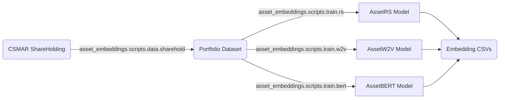

# Installation

> Part of [AssetEmbeddings](../index.md). See also [Training](train.md), [Data acquisition](prepare-data.md).

## Prerequisites

- Python >= 3.12
- CUDA-compatible GPU (recommended)
- 6GB+ RAM for large-scale training

## Install with [uv](https://docs.astral.sh/uv/) (recommended)

```bash
git clone https://github.com/Initial-Singularity/AssetEmbeddingsInChina.git
cd AssetEmbeddingsInChina
uv sync
```

## Install with pip

```bash
git clone https://github.com/Initial-Singularity/AssetEmbeddingsInChina.git
cd AssetEmbeddingsInChina
pip install -e .
```

## Downloading the demo dataset

Production runs need CSMAR data — see [data.md](prepare-data.md). For the quickstart
notebook you can use the bundled synthetic dataset under `examples/data/`;
no external data is required.

## Quickstart with presets

We provide presets for batch-generating configuration files, and hand-written
bash scripts for orchestrating experiment pipelines. For details on
preset-based config generation, see
[FastGenerator documentation](generate-configs.md).

```bash
# Linux/macOS — assumes raw CSMAR data has been downloaded
cd AssetEmbeddingsInChina

# Data preprocessing
bash scripts/run/run_notify.sh scripts/run/data_preprocess.sh

# Generate training configs from preset
uv run python -m scripts.tools.fast_generator config \
    -f templates/train_main.json
# Run pretrain + finetune
bash scripts/run/run_notify.sh scripts/run/train_main.sh
```

## Execution framework

Experiment scripts are executed via `run_notify.sh`, which wraps any script
with email notifications and status reporting. It works together with
`run_helper.sh`, which provides error-tolerant batch execution with
marker-based filtering:

```bash
# Run only BERT-related tasks
bash scripts/run/run_notify.sh -k bert scripts/run/train_main.sh

# Exclude RS models, stop after 3 errors
bash scripts/run/run_notify.sh -e rs -M 3 scripts/run/train_main.sh

# Verbose output with error email throttling
bash scripts/run/run_notify.sh -v -T 300 scripts/run/train_main.sh
```

Key features:
- **Marker-based filtering**: Each task is tagged with markers
  (e.g., `bert`, `pretrain`, `d64`). Use `-k` (include) and `-e` (exclude)
  to select subsets.
- **Error handling**: `-M` sets max errors before abort; `-T` throttles
  per-error email notifications.
- **Status tags**: Completion emails are tagged `[SUCCESS]`, `[PARTIAL]`,
  or `[FAILED]` based on results.

## Project architecture overview

```
AssetEmbeddings/
├── asset_embeddings/         # Core framework
│   ├── modules/              # PyTorch module implementations
│   ├── configs/              # Configuration management
│   ├── records/              # Experiment recording & persistence
│   ├── datasets.py           # Data loading, processing, organizing
│   ├── logger.py             # Colored logging system
│   ├── preparers.py          # Preparer for logger, dataset, tokenizer, models
│   └── scripts/              # CLI entry points
│       ├── data/             # data_* equivalents
│       └── train/            # train_* equivalents
├── scripts/                  # Shell scripts
│   ├── run/                  # Experiment pipelines
│   └── ops/                  # Operational utilities
├── templates/                # Config generation templates
├── examples/                 # Quickstart notebook
└── docs/                     # Developer guides and reproduction notes
```

### Data-flow pipeline



## Data preprocessing reference

The data-preprocessing tools live under `asset_embeddings.scripts.data` and
each accepts a CLI of the form

```bash
uv run python -m asset_embeddings.scripts.data.sharehold [args...]
```

See [data.md](prepare-data.md) for the per-tool argument reference and the CSMAR
schema needed to feed them.
