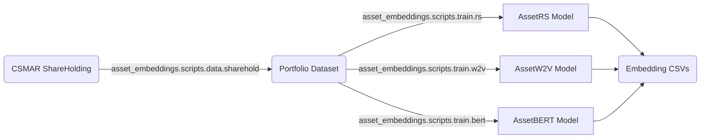

# 安装

> 隶属于 [AssetEmbeddings](../index.md)。另见 [训练](train.md)、[数据获取](prepare-data.md)。

## 前置条件

- Python >= 3.12
- 兼容 CUDA 的 GPU（推荐）
- 大规模训练需 6GB 以上内存

## 使用 [uv](https://docs.astral.sh/uv/) 安装（推荐）

```bash
git clone https://github.com/Initial-Singularity/AssetEmbeddingsInChina.git
cd AssetEmbeddingsInChina
uv sync
```

## 使用 pip 安装

```bash
git clone https://github.com/Initial-Singularity/AssetEmbeddingsInChina.git
cd AssetEmbeddingsInChina
pip install -e .
```

## 下载演示数据集

生产运行需要 CSMAR 数据——参见 [准备数据](prepare-data.md)。对于快速上手 notebook，你可以使用 `examples/data/` 下随附的合成数据集；不需要任何外部数据。

## 用预设快速上手

我们提供了用于批量生成配置文件的预设（preset），以及用于编排实验流水线的手写 bash 脚本。基于预设的配置生成详情，参见 [FastGenerator 文档](generate-configs.md)。

```bash
# Linux/macOS —— 假设原始 CSMAR 数据已下载
cd AssetEmbeddingsInChina

# 数据预处理
bash scripts/run/run_notify.sh scripts/run/data_preprocess.sh

# 从预设生成训练配置
uv run python -m scripts.tools.fast_generator config \
    -f templates/train_main.json
# 运行预训练 + 微调
bash scripts/run/run_notify.sh scripts/run/train_main.sh
```

## 执行框架

实验脚本通过 `run_notify.sh` 执行，它把任意脚本包裹起来，附带邮件通知与状态汇报。它与 `run_helper.sh` 协同工作——后者提供容错的批量执行，并支持基于标记（marker）的过滤：

```bash
# 仅运行 BERT 相关任务
bash scripts/run/run_notify.sh -k bert scripts/run/train_main.sh

# 排除 RS 模型，出错 3 次后停止
bash scripts/run/run_notify.sh -e rs -M 3 scripts/run/train_main.sh

# 详细输出，并对错误邮件做节流
bash scripts/run/run_notify.sh -v -T 300 scripts/run/train_main.sh
```

关键特性：
- **基于标记的过滤**：每个任务都带有标记（如 `bert`、`pretrain`、`d64`）。用 `-k`（包含）和 `-e`（排除）来选取子集。
- **错误处理**：`-M` 设定中止前的最大错误数；`-T` 对单次错误的邮件通知做节流。
- **状态标签**：完成邮件会根据结果标注 `[SUCCESS]`、`[PARTIAL]` 或 `[FAILED]`。

## 项目架构概览

```
AssetEmbeddings/
├── asset_embeddings/         # 核心框架
│   ├── modules/              # PyTorch 模块实现
│   ├── configs/              # 配置管理
│   ├── records/              # 实验记录与持久化
│   ├── datasets.py           # 数据加载、处理、组织
│   ├── logger.py             # 彩色日志系统
│   ├── preparers.py          # logger / dataset / tokenizer / 模型的 Preparer
│   └── scripts/              # CLI 入口
│       ├── data/             # 对应原 data_*
│       └── train/            # 对应原 train_*
├── scripts/                  # Shell 脚本
│   ├── run/                  # 实验流水线
│   └── ops/                  # 运维工具
├── templates/                # 配置生成模板
├── examples/                 # 快速上手 notebook
└── docs/                     # 开发指南与复现说明
```

### 数据流水线



## 数据预处理参考

数据预处理工具位于 `asset_embeddings.scripts.data` 下，每个都接受形如下式的 CLI：

```bash
uv run python -m asset_embeddings.scripts.data.sharehold [args...]
```

逐工具的参数参考、以及喂给它们所需的 CSMAR schema，参见 [准备数据](prepare-data.md)。
