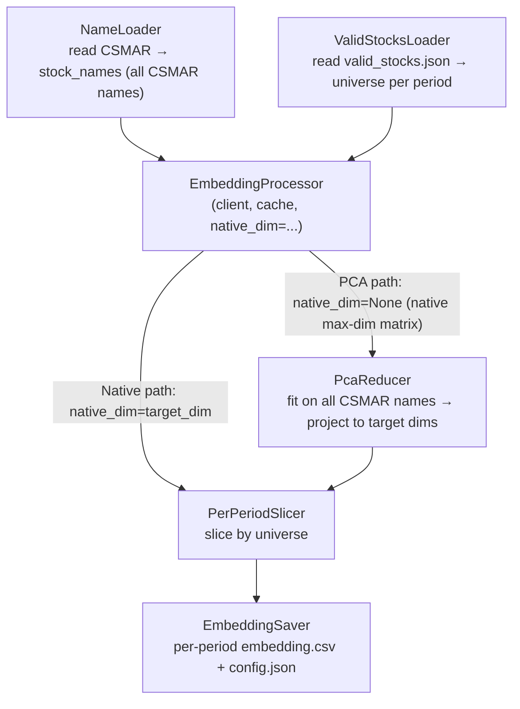

# Text embeddings

This document describes the design and usage of `asset_embeddings.scripts.data.text_embedding`, along with the integration notes for each provider (including the pitfalls we hit).

## Contents

- [Overview](#overview)
- [Pipeline architecture](#pipeline-architecture)
- [Classes and contracts](#classes-and-contracts)
- [Cache design](#cache-design)
- [Dimensionality handling (PCA vs Native)](#dimensionality-handling-pca-vs-native)
- [Provider adapters](#provider-adapters)
- [L2-normalization policy](#l2-normalization-policy)
- [CLI usage](#cli-usage)
- [API proxy and connectivity](#api-proxy-and-connectivity)
- [Key decisions and history](#key-decisions-and-history)

---

## Overview

`asset_embeddings.scripts.data.text_embedding` encodes the Chinese/English names of A-share companies into embeddings, written with the standard embedding-file schema (`Token, Emb_0, …, Emb_{d-1}`, the same as model embeddings), so they can be compared side by side with the trained asset embeddings. Design principles:

- **CLI style**: aligned with `asset_embeddings.scripts.data.sharehold` (one class per stage, `logger` + `@log_exceptions_inclass`).
- **Provider extensibility**: 5 providers × multiple transforms × multiple target dims, all produced in a single invocation.
- **Resumable**: append-only JSONL cache, so re-running after a crash wastes zero API quota.
- **Fail-fast**: validation at startup, to avoid silently producing zero files.

The original design draft is in `_dev/text-embedding-comparison/design.md`.

## Pipeline architecture



## Classes and contracts

| Class | Responsibility |
|---|---|
| `NameLoader` | Reads `TRD_Co.csv`, outputs `Stkcd, name_zh, name_zh_short, name_en, name_source`. |
| `ValidStocksLoader` | Reads `{period}/valid_stocks.json`, returns `{period: [Stkcd, ...]}`. |
| `EmbeddingCache` | Append-only JSONL; the key is derived from `sha1(provider\|model\|lang\|native_dim\|text)[:16]`. |
| `BaseEmbeddingClient` | Provider-adapter ABC: `name`, `model`, `native_max_dim`, `supported_native_dims()`, `embed(texts, dim)`. |
| `EmbeddingProcessor` | Orchestrates cache → API → cache for a single `native_dim`, with batching + tqdm. |
| `PcaReducer` | Fits an independent `PCA(n_components=d).fit(...)` for each `target_dim` (sharing the same `random_state`); does not guarantee nesting (`out[8][:, :4] != out[4]`). `pca-universal` fits once on the full CSMAR sample and then slices to every period; `pca-perperiod` fits independently on each period's valid_stocks subset. |
| `PerPeriodSlicer` | Slices by universe, outputs `{period: DataFrame[Token, Emb_0...Emb_{d-1}]}`. |
| `EmbeddingSaver` | Writes each period's CSV + a shared `config.json`. |

`BaseEmbeddingClient.supported_native_dims()` is three-state:

- `None` → continuous support over `[1, native_max_dim]` (OpenAI, Local Matryoshka).
- A discrete `set` → only the dims in the set (Cohere, Voyage, Gemini).
- An empty `set()` → no native dim parameter is supported (not currently used).

## Cache design

**Cache key**:

```python
sha1(f"{provider}|{model}|{lang}|{native_dim}|{text}").hexdigest()[:16]
```

- `native_dim` is the dimension actually requested from the API; the PCA path uses `native_max_dim`, the Native path uses `target_dim`.
- All PCA target_dims for the same `(provider, model, lang)` share one cache (saving API calls).
- The Native path does not share a cache across different target_dims (the API returns different lengths).

**Cache file**: `data/text_embeddings/cache/{provider}_{model_slug}_{lang}_{tag}.jsonl`

- `tag = max_d{native_max}` — PCA path
- `tag = native_d{target_dim}` — Native path

Write strategy: append-only JSONL, with `f.flush()` + `os.fsync()` per record, so a crash loses no data.

## Dimensionality handling (PCA vs Native)

For each `(provider, model, lang)`, the three transforms can be combined freely:

### `pca-universal` (paper-style static baseline)
- `EmbeddingProcessor(native_dim=None)` takes the native max-dim matrix (all CSMAR names).
- `PcaReducer` fits `PCA(n_components=d)` on **all CSMAR names**, fitting **once per target_dim** (default `random_state=args.seed=42`).
- All periods are projected onto the same basis (the full CSMAR sample); each per-period CSV is that period's subset within the unified coordinate system.
- Meaning: the global structure of the text representation, with all periods sharing a single coordinate system.

### `pca-perperiod` (asset-embedding-aligned version)
- Also takes the native max-dim matrix; **fits a PCA once per period**, where the fit set is that period's valid_stocks subset.
- Each period has its own basis — the same stock has **different** pca-perperiod coordinates in different periods (measured max difference of 0.63 for the same stock between 2024Q1 and 2024Q2).
- Meaning: just like asset embeddings, "the basis drifts with the universe."
- A simple sanity check: on its own fit set, the variance of the PC columns should be strictly decreasing (measured for BGE/2024Q1: `[0.118, 0.111, 0.105, 0.103, 0.097]` ✓).

### `native` (decided per provider)
- **OpenAI** (continuous): invoke the API separately for each target_dim.
- **Local Matryoshka (Qwen, BGE)**: take native_max → truncate + L2-renormalize.
- **Cohere / Voyage / Gemini**: `supported_native_dims()` does not contain any target_dim → skip each one + warn.

### Important notes
- **PCA does not do nested slicing**: each target_dim is the result of an independent `PCA(n_components=d).fit_transform()`. Under sklearn's default randomized SVD, `pca-universal_d4` does not equal `pca-universal_d10[:, :4]` — this is intentional (the user required each target_dim to be an independent estimate). For strict nesting, you would need to switch to `svd_solver='full'`.
- **PCA does not L2-normalize**: principal components have no unit-length semantics; if a downstream cosine comparison needs normalization, renorm it yourself.
- **`--transforms native` fail-fast**: when running cohere/voyage/gemini × without any `pca-*` transform, `validate_args` raises at startup, to avoid silently producing zero files.
- **Small-period defense**: if a period's valid_stocks is smaller than some target_dim, that (period, d) combination is skipped + warned, while the other combinations continue.

### `--seed` control
Every PCA call uses `args.seed` (default 42) as its `random_state`, so the same input with the same seed produces exactly identical output (convenient for reproducibility and git diff).

## Provider adapters

| Provider | SDK | model (default) | `supported_native_dims()` | `native_max_dim` | Server-side normalization? |
|---|---|---|---|---|---|
| OpenAI | `openai>=1.78` | `text-embedding-3-small` | `None` (continuous) | 1536 (small) / 3072 (large) | Yes |
| Cohere | `cohere>=5.15` | `embed-v4.0` | `{256, 512, 1024, 1536}` | 1536 | Yes |
| Voyage | `voyageai>=0.3` | `voyage-3-large` | `{256, 512, 1024, 2048}` | 2048 | Yes |
| Gemini | `google-genai>=1.0` | `gemini-embedding-001` | `{768, 1536, 3072}` | 3072 | **No (when dim < 3072)** |
| Local Qwen | `transformers` | Qwen3-Embedding-{0.6,4,8}B | `None` (Matryoshka) | 1024/2560/4096 | No (normalized inside the adapter) |
| Local BGE | `transformers` | `BAAI/bge-m3` | `None` (Matryoshka) | 1024 | No (normalized inside the adapter) |

Integration notes per provider:

### Cohere

- SDK: `cohere.ClientV2(api_key)`; call `client.embed(model, input_type, embedding_types=["float"], texts, output_dimension)`.
- **API field name**: the response is an `EmbedByTypeResponse`, and the embeddings live at `resp.embeddings.float_` (a pydantic alias that avoids the python keyword) — **not** `.float`.
- `input_type="search_document"`: stock names are documents being indexed, which matches the semantics of Voyage's `input_type="document"`; do not write it as `"search_query"`.
- Only `embed-v4.0` is within this project's support range; the v3 series has a different output_dimension policy (no 256/512/1536), so do not add it straight into `_NATIVE_MAX` without updating `supported_native_dims()`.

### Voyage

- SDK: `voyageai.Client(api_key=...)`; call `client.embed(texts, model, input_type="document", output_dimension)`.
- Response: `EmbeddingsObject(.embeddings: list[list[float]])` — wrap directly with `np.array(...)`.
- The 0.3.x SDK does not expose the set of supported dims, so this project hard-codes the known set; if you confirm Voyage has shipped a new dim, update `SUPPORTED_DIMS_BY_MODEL`.

### Gemini

- SDK: `from google import genai`; `genai.Client(api_key=...)`.
- Call: `client.models.embed_content(model, contents=texts, config=genai.types.EmbedContentConfig(output_dimensionality=N))`.
- Response: `EmbedContentResponse.embeddings: list[ContentEmbedding(values=[float])]` — iterate over `e.values`.
- **Key pitfall**: Gemini does **not** automatically L2-normalize when `output_dimensionality < native_max_dim` (the [official docs](https://ai.google.dev/gemini-api/docs/embeddings) explicitly require the user to normalize themselves). The adapter already adds a renorm internally, but remember to verify it when a new model/new dim ships.

### Local HF (Qwen3-Embedding + BGE-m3)

- VRAM pre-check at startup: `required_gb = approx_params * dtype_bytes * 1.3`; exceeding 90% of available VRAM only warns, it does not abort.
- Pooling is dispatched by `MODEL_PROFILES`:
  - Qwen3-Embedding series → **last-token** (index the last non-padding token via `attention_mask.sum(dim=1) - 1`).
  - BGE-m3 → **CLS** (first token).
- `embed()` always does `vec.float()` first, then `F.normalize(p=2, dim=1)`. **This order matters**: a bf16 model's `vec` normalized in bf16 and then cast to fp32 has a row-norm off by ~1e-3 (bf16 only has ~3 decimal digits of precision). Casting first and normalizing after, the row-norm converges strictly to 1e-7 within fp32.
- `--hf-dtype int8` / `int4` are CLI choices (an escape hatch offered to the user in the VRAM warning), but a real quantization path is not implemented yet — the adapter raises `NotImplementedError` rather than silently downgrading to bf16.

## L2-normalization policy

Normalization behavior differs by location (**important**):

| Location | Normalized? | Reason |
|---|---|---|
| `OpenAIEmbeddingClient.embed` | Pass-through | Server-side normalization. |
| `CohereEmbeddingClient.embed` | Pass-through | Server-side normalization (probe measured norm = 1.0). |
| `VoyageEmbeddingClient.embed` | Pass-through | Server-side normalization (probe measured norm = 1.0). |
| `GeminiEmbeddingClient.embed` | **Explicit adapter normalization** | Gemini does not normalize when dim < native_max (probe measured norm ≈ 0.59); the adapter adds one `arr / np.linalg.norm(arr, axis=1, keepdims=True)`. |
| `LocalHFEmbeddingClient.embed` | **Explicit adapter normalization** | After Matryoshka truncation, the L2 norm is no longer 1. |
| `PcaReducer.fit_transform_all` | **Not normalized** | PCA principal components have no unit-length semantics; if a downstream cosine comparison is needed, normalize yourself. |

**Contract for callers**: every row out of the 5 adapters' `embed()` has L2 norm 1 (within fp32 precision), so it can be used directly with cosine = inner product. But the rows in `pca_d{N}/embedding.csv` are **not** unit vectors — each downstream consumer decides for itself whether to normalize.

## CLI usage

Full command:

```bash
uv run python -m asset_embeddings.scripts.data.text_embedding \
    --csmar-info data/text_embeddings/csmar/TRD_Co.csv \
    --valid-stocks-dir data/processed/ShareHoldingIntermediate \
    --names-output data/text_embeddings/names \
    --cache-folder data/text_embeddings/cache \
    --output-folder data/text_embeddings/embeddings \
    --provider openai \
    --model text-embedding-3-small \
    --language zh \
    --transforms native pca-universal pca-perperiod \
    --target-dims 4 8 10 16 32 64 128 \
    --batch-size 100 \
    --max-retries 6 \
    --seed 42 \
    --periods 2023Q2 2023Q3 2023Q4 2024Q1 2024Q2 2024Q3 \
    --device cuda:0 \
    --hf-dtype bfloat16 \
    --log logs/text_embedding/openai-3small-zh.log \
    --verbose true
```

**Flags** — the complete set (`-h` prints this too); required args may come via CLI or `--config`:

| Flag | Type / choices | Description |
|---|---|---|
| `--config`, `-c` | `str` | JSON config; its keys become argparse defaults (hyphen *and* underscore keys accepted, unknown keys rejected), and explicit CLI flags still override. |
| `--mode` | `{names, full}` | `names` runs the name stage only; `full` runs the embedding pipeline. Default: `full`. |
| `--csmar-info` | `str` | Path to CSMAR `TRD_Co.csv`. **Required** (CLI or config). |
| `--valid-stocks-dir` | `str` | Directory of `{period}/valid_stocks.json` (from `data.sharehold`). **Required**. |
| `--periods` | `str …` | Subset of periods to process. Default: all under `--valid-stocks-dir`. |
| `--names-output` | `str` | Names-stage output dir (`stock_names.csv`, `missing_stocks.csv`). Default: `data/text_embeddings/names`. |
| `--cache-folder` | `str` | JSONL embedding-cache dir. Default: `data/text_embeddings/cache`. |
| `--output-folder` | `str` | Root for embedding artifacts. Default: `data/text_embeddings/embeddings`. |
| `--provider` | `{openai, cohere, voyage, gemini, local}` | Embedding provider. **Required for `--mode full`**. |
| `--model` | `str` | Provider-specific model id. **Required for `--mode full`**. |
| `--language` | `{zh, zh-short, en}` | `zh`=Conme, `zh-short`=Stknme, `en`=Conme_en. Default: `zh`. |
| `--transforms` | `{native, pca-universal, pca-perperiod} …` | Dimensionality strategies to produce (combinable). Default: `native pca-universal`. |
| `--target-dims` | `int …` | Target dims. Default: `4 8 10 16 32 64 128`. |
| `--seed` | `int` | PCA `random_state`. Default: `42`. |
| `--batch-size` | `int` | Texts/request (hosted) and GPU mini-batch (local); clamped to each provider's `max_batch_size`. Default: `100`. |
| `--max-retries` | `int` | Max tenacity retries per batch. Default: `6`. |
| `--api-key` | `str` | Literal API key; highest precedence. |
| `--api-key-env` | `str` | Env var name to read the key from (used only if `--api-key` is unset; errors loudly if that var is itself unset). |
| `--device` | `str` | Device for local HF models (ignored for hosted). Default: `cuda:0`. |
| `--hf-dtype` | `{bfloat16, float16, float32, int8, int4}` | Local model dtype. Default: `bfloat16`. `int8`/`int4` are escape-hatch choices — not yet implemented (raise `NotImplementedError`). |
| `--missing-name-fallback` | `{skip, akshare, error}` | For stocks in valid_stocks but missing from CSMAR (full mode): `skip` drops them with a warning (default); `error` aborts; `akshare` is reserved (raises `NotImplementedError`). |
| `--verbose`, `-v` | `bool` | DEBUG console logging. Default: `False`. |
| `--log`, `-l` | `str` | Log-file path. Default: none. |

API-key resolution precedence: `--api-key` > `--api-key-env` > the provider-default env var (table below).

**Modes**:

- `--mode names` — runs only NameLoader + ValidStocksLoader, producing `stock_names.csv` + `missing_stocks.csv`. No API key or GPU required.
- `--mode full` (default) — the full pipeline (including embedding API calls).

**Output layout**:

`EmbeddingSaver` creates `{provider}_{model_slug}_{lang}_{transform}_d{dim}/{period}/embedding.csv` under `--output-folder`.

- Bare CLI (without `--config`) + the default `--output-folder data/text_embeddings/embeddings`: all results are laid out flat.
- The 18 configs generated from `templates/data_text_embedding.json` set `output_folder` to `data/text_embeddings/embeddings/{model_slug}`, so each of the 9 models gets its own folder, under which `2 lang × 3 transform × 7 dim = 42` subdirectories are placed, avoiding having all 378 directories laid out flat together. `{model_slug}` appears twice in the path (outer namespace + inner subdirectory prefix); this is so the saver's subdirectory names stay self-contained and downstream globs over them do not need to change.

**Default API-key environment variables**:

| Provider | env var |
|---|---|
| openai | `OPENAI_API_KEY` |
| cohere | `COHERE_API_KEY` |
| voyage | `VOYAGE_API_KEY` |
| gemini | `GOOGLE_API_KEY` |

The `.env` file is loaded by `python-dotenv` at the `main()` entry point, so you do not need to `source` it manually.

**What `--batch-size` does**:

- For hosted providers: the number of texts per API request.
- For local HF models: it is also the GPU mini-batch size (`LocalHFEmbeddingClient.batch_size_internal`).

**Provider-side rate constraints (three class attributes, applied automatically by `EmbeddingProcessor`)**:

Each hosted provider has two kinds of hard limit: a per-request text ceiling (exceeding it → 400 BadRequest) and a rate ceiling (exceeding it → 429 RESOURCE_EXHAUSTED). The rate ceiling further splits into two kinds: RPM-based (N requests/minute regardless of batch size, e.g. Gemini) and inputs-rate (N texts/minute regardless of the number of requests, e.g. Cohere). Three class attributes each govern one axis:

- `max_batch_size`: the text ceiling for a single `embed()`; the processor `__init__` clamps `--batch-size` to it, warns one line, and continues normally.
- `min_request_interval`: the minimum number of seconds between two `embed()` calls (the RPM-class constraint).
- `max_inputs_per_minute`: the cumulative inputs/min ceiling (the Cohere-class constraint); the processor derives `interval = batch_size * 60 / max_inputs_per_minute` in `process()`.

The inter-call interval that actually takes effect = `max(min_request_interval, derived_from_max_inputs_per_minute)`. If both are None, there is no throttling at all.

| Provider | `max_batch_size` | `min_request_interval` | `max_inputs_per_minute` | Primary constraint / notes |
|---|---|---|---|---|
| OpenAI | `None` | `None` | `None` | Tier 1+ (≥$5 paid): ~3,000 RPM + 1M TPM on the embeddings endpoint, so a batch of 60 at a time only uses ~120 RPM. The free tier has no embeddings quota limit (billed at $100/month of usage), so running a batch is fine in practice |
| Cohere v4 | `96` | `None` | `1840` | 96/request; trial and production are the same: 2,000 inputs/min ([docs](https://docs.cohere.com/docs/rate-limits)). 1840 = 2000 × 0.92 (8% headroom). At batch=96 the derived interval is ≈ 3.13s/call |
| Voyage | `128` | `None` (dynamic) | `None` | **Before adding a card**: 3 RPM + 10K TPM; **the adapter auto-detects** the first RateLimitError containing "have not yet added your payment method", then sets `min_request_interval` to 21s and continues. After adding a card (Tier 1): 2,000 RPM + 3M TPM, no throttling needed |
| Gemini | `100` | `0.65s` | `None` | Free tier 100 RPM + **1,000 RPD**; 0.65s/req ≈ 92/min (per-minute headroom). **When the daily quota is exhausted** (quotaId contains `PerDay`) the adapter aborts immediately and logs a clear error (no more useless retries); the cache is already persisted, so you can resume the next day |
| Local HF | `None` | `None` | `None` | No API limits; the GPU mini-batch is managed by `batch_size_internal` itself |

`EmbeddingProcessor` re-reads `client.min_request_interval` before each batch, so an adapter that mutates this attribute mid-run takes effect immediately (this is how Voyage's unpaid-tier auto-throttle works).

At startup, if throttling is in effect (≥0.5s) it logs one line `Throttle: sleeping >=Xs between calls (...)`; it logs again when the interval changes mid-run.

**429 defenses**:

- **Gemini per-minute quota**: a custom tenacity wait parses `error.details[i].retryDelay` (the `RetryInfo` proto) from the response, sleeps for that long + a 1s buffer. On a parse failure it falls back to 60s. The log looks like `Gemini 429 RESOURCE_EXHAUSTED: API requested retry after 42.5s; sleeping (+1s buffer).`
- **Gemini per-day quota**: a custom tenacity stop parses `error.details[i].violations[0].quotaId`; if it contains `PerDay` it aborts directly, with no more useless retries. Log: `Gemini DAILY quota exhausted (...); resets at midnight Pacific. Cache is preserved (append-only JSONL), so re-running after the reset will continue where it stopped.`
- **Voyage unpaid tier**: a custom wait detects that the RateLimitError string contains "have not yet added your payment method" → mutates `self.min_request_interval = 21.0` once (3 RPM headroom), and the next batch is automatically throttled to 21s by the processor. A one-time warn: `Voyage unpaid tier detected (3 RPM, 10K TPM). Engaging 21s/call throttle for the rest of this run. Add a payment method at https://dashboard.voyageai.com/ to lift to 2,000 RPM.`

## API proxy and connectivity

Accessing Cohere / Voyage / Gemini from inside China usually requires going through a proxy. All three SDKs respect the standard `HTTPS_PROXY` environment variable:

```bash
export HTTPS_PROXY=http://127.0.0.1:7890
export HTTP_PROXY=http://127.0.0.1:7890
uv run python -m asset_embeddings.scripts.data.text_embedding ...
```

Windows PowerShell:

```powershell
$env:HTTPS_PROXY = "http://127.0.0.1:7890"
$env:HTTP_PROXY  = "http://127.0.0.1:7890"
```

**Note**: the env vars must be set before the SDK is imported (the httpx client snapshots the environment at construction time). `asset_embeddings.scripts.data.text_embedding` calls `load_dotenv()` before importing the SDKs at the top of `main()`, so writing `HTTPS_PROXY` in `.env` also works.

**Connectivity-probe script**: `_dev/text-embedding-comparison/scripts/probe_apis.py` is a minimal connectivity test (2 short Chinese names per provider, minimum dim), for verifying the key + proxy before a large run. The `_dev/` directory is gitignored, so you need to copy it locally yourself.

## Key decisions and history

- **`pca-universal` vs `pca-perperiod`**: the original design.md only designed universal (fit once on all of CSMAR). perperiod was added later as an additional transform (not a replacement), because the argument is: asset embeddings are trained per-period, so a per-period text PCA is what aligns with them. Both are produced, and downstream comparisons can decide which conclusion is more robust. Universal's potential bias is "the text representation does not drift with the universe"; perperiod's potential bias is "the variance estimate for a small period is unstable".
- **PCA does not nest**: each target_dim is fit independently. The user decided not to rely on `out[8][:, :4] == out[4]` (which holds exactly only under `svd_solver='full'`; under the default randomized solver the two are numerically unequal). To go back to nested slicing later, just change the internals of `PcaReducer`.
- **bf16 → fp32 order**: `LocalHFEmbeddingClient` must do `.float()` before `F.normalize`, otherwise the row-norm is off by ~1e-3.
- **Gemini renorm**: the design phase in design.md did not touch the detail that Gemini does not auto-normalize; it was only discovered during the session-03 probe phase, and the adapter added an explicit renorm.
- **API-key security**: `config.json` and the logs only echo the first 8 characters + `...` (`_redact_api_key`). `embed.ipynb` (the old version) once leaked the OpenAI / Cohere keys into git history — they have been revoked.

See `_dev/text-embedding-comparison/devlog.md` and the individual `logs/session-NN-*.md` for the detailed history.
