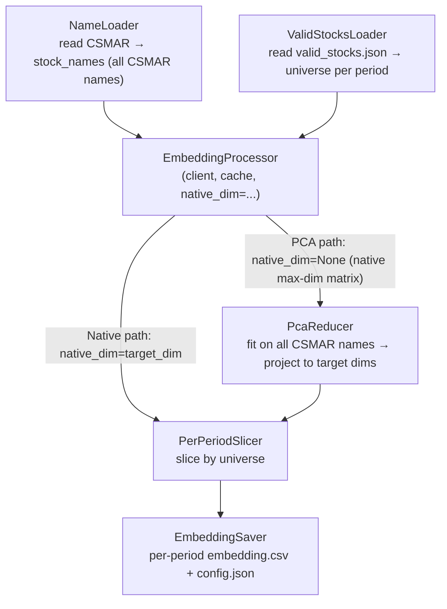

# Text embeddings

本文档介绍 `asset_embeddings.scripts.data.text_embedding` 的设计与使用，以及各 provider 的接入说明（包括踩过的坑）。

## 目录

- [概述](#概述)
- [流水线架构](#流水线架构)
- [类与契约](#类与契约)
- [缓存设计](#缓存设计)
- [维度处理（PCA vs 原生）](#维度处理pca-vs-原生)
- [Provider 适配器](#provider-适配器)
- [L2 归一化策略](#l2-归一化策略)
- [CLI 使用](#cli-使用)
- [API 代理与连通性](#api-代理与连通性)
- [关键决策与历史](#关键决策与历史)

---

## 概述

`asset_embeddings.scripts.data.text_embedding` 把 A 股公司的中/英文名称编码为嵌入，并以标准的嵌入文件 schema（`Token, Emb_0, …, Emb_{d-1}`，与模型嵌入一致）写出，以便与训练得到的资产嵌入并排比较。设计原则：

- **CLI 风格**：与 `asset_embeddings.scripts.data.sharehold` 对齐（每个阶段一个类，`logger` + `@log_exceptions_inclass`）。
- **provider 可扩展**：5 个 provider × 多种 transform × 多个目标维度，一次调用全部产出。
- **可续传**：仅追加的 JSONL 缓存，崩溃后重跑零浪费 API 配额。
- **快速失败**：启动时校验，避免悄无声息地产出零文件。

最初的设计草稿见 `_dev/text-embedding-comparison/design.md`。

## 流水线架构



## 类与契约

| 类 | 职责 |
|---|---|
| `NameLoader` | 读取 `TRD_Co.csv`，输出 `Stkcd, name_zh, name_zh_short, name_en, name_source`。 |
| `ValidStocksLoader` | 读取 `{period}/valid_stocks.json`，返回 `{period: [Stkcd, ...]}`。 |
| `EmbeddingCache` | 仅追加的 JSONL；键由 `sha1(provider\|model\|lang\|native_dim\|text)[:16]` 导出。 |
| `BaseEmbeddingClient` | provider 适配器 ABC：`name`、`model`、`native_max_dim`、`supported_native_dims()`、`embed(texts, dim)`。 |
| `EmbeddingProcessor` | 为单一 `native_dim` 编排 cache → API → cache，含批处理 + tqdm。 |
| `PcaReducer` | 对每个 `target_dim` 拟合一个独立的 `PCA(n_components=d).fit(...)`（共享同一 `random_state`）；不保证嵌套（`out[8][:, :4] != out[4]`）。`pca-universal` 在全部 CSMAR 样本上拟合一次再切片到每个期；`pca-perperiod` 在每个期的 valid_stocks 子集上独立拟合。 |
| `PerPeriodSlicer` | 按 universe 切片，输出 `{period: DataFrame[Token, Emb_0...Emb_{d-1}]}`。 |
| `EmbeddingSaver` | 写出每个期的 CSV + 一份共享的 `config.json`。 |

`BaseEmbeddingClient.supported_native_dims()` 是三态的：

- `None` → 在 `[1, native_max_dim]` 上连续支持（OpenAI、本地 Matryoshka）。
- 一个离散 `set` → 仅集合内的维度（Cohere、Voyage、Gemini）。
- 一个空 `set()` → 不支持任何原生维度参数（当前未使用）。

## 缓存设计

**缓存键**：

```python
sha1(f"{provider}|{model}|{lang}|{native_dim}|{text}").hexdigest()[:16]
```

- `native_dim` 是实际向 API 请求的维度；PCA 路径用 `native_max_dim`，原生路径用 `target_dim`。
- 同一 `(provider, model, lang)` 的所有 PCA target_dims 共享一份缓存（节省 API 调用）。
- 原生路径不在不同 target_dim 之间共享缓存（API 返回的长度不同）。

**缓存文件**：`data/text_embeddings/cache/{provider}_{model_slug}_{lang}_{tag}.jsonl`

- `tag = max_d{native_max}` —— PCA 路径
- `tag = native_d{target_dim}` —— 原生路径

写入策略：仅追加的 JSONL，每条记录都 `f.flush()` + `os.fsync()`，故崩溃不丢数据。

## 维度处理（PCA vs 原生）

对每个 `(provider, model, lang)`，三种 transform 可自由组合：

### `pca-universal`（论文式静态基线）
- `EmbeddingProcessor(native_dim=None)` 取原生最大维矩阵（全部 CSMAR 名称）。
- `PcaReducer` 在**全部 CSMAR 名称**上拟合 `PCA(n_components=d)`，**每个 target_dim 拟合一次**（默认 `random_state=args.seed=42`）。
- 所有期都投影到同一基（全部 CSMAR 样本）；每个逐期 CSV 是该期在统一坐标系中的子集。
- 含义：文本表示的全局结构，所有期共享同一坐标系。

### `pca-perperiod`（与资产嵌入对齐的版本）
- 同样取原生最大维矩阵；**每个期拟合一次 PCA**，拟合集是该期的 valid_stocks 子集。
- 每个期有自己的基——同一只股票在不同期的 pca-perperiod 坐标**不同**（实测同一只股票在 2024Q1 与 2024Q2 之间的最大差为 0.63）。
- 含义：正如资产嵌入，“基随 universe 漂移”。
- 一个简单的合理性检查：在其自身拟合集上，各 PC 列的方差应严格递减（实测 BGE/2024Q1：`[0.118, 0.111, 0.105, 0.103, 0.097]` ✓）。

### `native`（逐 provider 决定）
- **OpenAI**（连续）：对每个 target_dim 分别调用 API。
- **本地 Matryoshka（Qwen、BGE）**：取 native_max → 截断 + L2 重归一化。
- **Cohere / Voyage / Gemini**：`supported_native_dims()` 不含任何 target_dim → 逐个跳过 + 告警。

### 重要说明
- **PCA 不做嵌套切片**：每个 target_dim 都是独立 `PCA(n_components=d).fit_transform()` 的结果。在 sklearn 默认的随机化 SVD 下，`pca-universal_d4` 不等于 `pca-universal_d10[:, :4]`——这是有意为之（用户要求每个 target_dim 都是独立估计）。若需要严格嵌套，应改用 `svd_solver='full'`。
- **PCA 不做 L2 归一化**：主成分没有单位长度语义；若下游余弦比较需要归一化，请自行重归一化。
- **`--transforms native` 快速失败**：当对 cohere/voyage/gemini 运行 × 且不带任何 `pca-*` transform 时，`validate_args` 会在启动时抛错，避免悄无声息地产出零文件。
- **小期防御**：若某期的 valid_stocks 小于某个 target_dim，则该 (period, d) 组合被跳过 + 告警，其余组合继续。

### `--seed` 控制
每次 PCA 调用都以 `args.seed`（默认 42）作为 `random_state`，故相同输入 + 相同种子产出完全一致的输出（便于复现与 git diff）。

## Provider 适配器

| Provider | SDK | model（默认） | `supported_native_dims()` | `native_max_dim` | 服务端归一化？ |
|---|---|---|---|---|---|
| OpenAI | `openai>=1.78` | `text-embedding-3-small` | `None`（连续） | 1536（small）/ 3072（large） | 是 |
| Cohere | `cohere>=5.15` | `embed-v4.0` | `{256, 512, 1024, 1536}` | 1536 | 是 |
| Voyage | `voyageai>=0.3` | `voyage-3-large` | `{256, 512, 1024, 2048}` | 2048 | 是 |
| Gemini | `google-genai>=1.0` | `gemini-embedding-001` | `{768, 1536, 3072}` | 3072 | **否（当 dim < 3072 时）** |
| 本地 Qwen | `transformers` | Qwen3-Embedding-{0.6,4,8}B | `None`（Matryoshka） | 1024/2560/4096 | 否（在适配器内部归一化） |
| 本地 BGE | `transformers` | `BAAI/bge-m3` | `None`（Matryoshka） | 1024 | 否（在适配器内部归一化） |

各 provider 的接入说明：

### Cohere

- SDK：`cohere.ClientV2(api_key)`；调用 `client.embed(model, input_type, embedding_types=["float"], texts, output_dimension)`。
- **API 字段名**：响应是 `EmbedByTypeResponse`，嵌入位于 `resp.embeddings.float_`（避开 python 关键字的 pydantic 别名）——**不是** `.float`。
- `input_type="search_document"`：股票名称是被索引的文档，这与 Voyage 的 `input_type="document"` 语义一致；不要写成 `"search_query"`。
- 本项目仅支持 `embed-v4.0`；v3 系列的 output_dimension 策略不同（无 256/512/1536），故不要把它直接加进 `_NATIVE_MAX` 而不更新 `supported_native_dims()`。

### Voyage

- SDK：`voyageai.Client(api_key=...)`；调用 `client.embed(texts, model, input_type="document", output_dimension)`。
- 响应：`EmbeddingsObject(.embeddings: list[list[float]])`——直接用 `np.array(...)` 包裹。
- 0.3.x SDK 不暴露支持维度集合，故本项目硬编码了已知集合；若确认 Voyage 上线了新维度，请更新 `SUPPORTED_DIMS_BY_MODEL`。

### Gemini

- SDK：`from google import genai`；`genai.Client(api_key=...)`。
- 调用：`client.models.embed_content(model, contents=texts, config=genai.types.EmbedContentConfig(output_dimensionality=N))`。
- 响应：`EmbedContentResponse.embeddings: list[ContentEmbedding(values=[float])]`——遍历 `e.values`。
- **关键坑**：当 `output_dimensionality < native_max_dim` 时，Gemini **不会**自动 L2 归一化（[官方文档](https://ai.google.dev/gemini-api/docs/embeddings) 明确要求用户自行归一化）。适配器已在内部加了重归一化，但每次上新模型/新维度时记得验证。

### 本地 HF（Qwen3-Embedding + BGE-m3）

- 启动时显存预检：`required_gb = approx_params * dtype_bytes * 1.3`；超过可用显存 90% 仅告警、不中止。
- pooling 由 `MODEL_PROFILES` 分派：
  - Qwen3-Embedding 系列 → **last-token**（通过 `attention_mask.sum(dim=1) - 1` 索引最后一个非 padding 词元）。
  - BGE-m3 → **CLS**（首词元）。
- `embed()` 总是先 `vec.float()` 再 `F.normalize(p=2, dim=1)`。**这个顺序很重要**：bf16 模型的 `vec` 在 bf16 下归一化再转 fp32，行范数会偏差约 1e-3（bf16 只有约 3 位十进制精度）。先转再归一化，行范数在 fp32 内严格收敛到 1e-7。
- `--hf-dtype int8` / `int4` 是 CLI 选项（在显存告警里提供给用户的逃生口），但真正的量化路径尚未实现——适配器抛 `NotImplementedError`，而非悄悄降级到 bf16。

## L2 归一化策略

归一化行为因位置而异（**重要**）：

| 位置 | 是否归一化？ | 原因 |
|---|---|---|
| `OpenAIEmbeddingClient.embed` | 透传 | 服务端归一化。 |
| `CohereEmbeddingClient.embed` | 透传 | 服务端归一化（探测实测范数 = 1.0）。 |
| `VoyageEmbeddingClient.embed` | 透传 | 服务端归一化（探测实测范数 = 1.0）。 |
| `GeminiEmbeddingClient.embed` | **适配器显式归一化** | dim < native_max 时 Gemini 不归一化（探测实测范数 ≈ 0.59）；适配器加一次 `arr / np.linalg.norm(arr, axis=1, keepdims=True)`。 |
| `LocalHFEmbeddingClient.embed` | **适配器显式归一化** | Matryoshka 截断后 L2 范数不再为 1。 |
| `PcaReducer.fit_transform_all` | **不归一化** | PCA 主成分无单位长度语义；若下游需要余弦比较，请自行归一化。 |

**对调用方的契约**：5 个适配器 `embed()` 输出的每一行 L2 范数都为 1（在 fp32 精度内），故可直接用余弦 = 内积。但 `pca_d{N}/embedding.csv` 中的行**不是**单位向量——各下游使用方自行决定是否归一化。

## CLI 使用

完整命令：

```bash
uv run python -m asset_embeddings.scripts.data.text_embedding \
    --csmar-info data/text_embeddings/csmar/TRD_Co.csv \
    --valid-stocks-dir data/processed/ShareHoldingIntermediate \
    --names-output data/text_embeddings/names \
    --cache-folder data/text_embeddings/cache \
    --output-folder data/text_embeddings/embeddings \
    --provider openai \
    --model text-embedding-3-small \
    --language zh \
    --transforms native pca-universal pca-perperiod \
    --target-dims 4 8 10 16 32 64 128 \
    --batch-size 100 \
    --max-retries 6 \
    --seed 42 \
    --periods 2023Q2 2023Q3 2023Q4 2024Q1 2024Q2 2024Q3 \
    --device cuda:0 \
    --hf-dtype bfloat16 \
    --log logs/text_embedding/openai-3small-zh.log \
    --verbose true
```

**参数** —— 完整集合（`-h` 也会打印）；必填项可经 CLI 或 `--config` 给出：

| 参数 | 类型 / 取值 | 说明 |
|---|---|---|
| `--config`, `-c` | `str` | JSON 配置；其键成为 argparse 默认值（连字符*与*下划线键均接受，未知键被拒绝），显式 CLI 参数仍会覆盖。 |
| `--mode` | `{names, full}` | `names` 仅运行名称阶段；`full` 运行嵌入流水线。默认：`full`。 |
| `--csmar-info` | `str` | CSMAR `TRD_Co.csv` 路径。**必填**（CLI 或 config）。 |
| `--valid-stocks-dir` | `str` | `{period}/valid_stocks.json` 所在目录（来自 `data.sharehold`）。**必填**。 |
| `--periods` | `str …` | 要处理的周期子集。默认：`--valid-stocks-dir` 下全部。 |
| `--names-output` | `str` | 名称阶段输出目录（`stock_names.csv`、`missing_stocks.csv`）。默认：`data/text_embeddings/names`。 |
| `--cache-folder` | `str` | JSONL 嵌入缓存目录。默认：`data/text_embeddings/cache`。 |
| `--output-folder` | `str` | 嵌入产物根目录。默认：`data/text_embeddings/embeddings`。 |
| `--provider` | `{openai, cohere, voyage, gemini, local}` | 嵌入 provider。**`--mode full` 时必填**。 |
| `--model` | `str` | provider 专属模型 id。**`--mode full` 时必填**。 |
| `--language` | `{zh, zh-short, en}` | `zh`=Conme，`zh-short`=Stknme，`en`=Conme_en。默认：`zh`。 |
| `--transforms` | `{native, pca-universal, pca-perperiod} …` | 要生成的降维策略（可组合）。默认：`native pca-universal`。 |
| `--target-dims` | `int …` | 目标维度。默认：`4 8 10 16 32 64 128`。 |
| `--seed` | `int` | PCA `random_state`。默认：`42`。 |
| `--batch-size` | `int` | 每请求文本数（在线）与 GPU mini-batch（本地）；裁剪到各 provider 的 `max_batch_size`。默认：`100`。 |
| `--max-retries` | `int` | 每批最大 tenacity 重试次数。默认：`6`。 |
| `--api-key` | `str` | 字面量 API key；优先级最高。 |
| `--api-key-env` | `str` | 用于读取 key 的环境变量名（仅当 `--api-key` 未设置时使用；若该变量本身未设则报错）。 |
| `--device` | `str` | 本地 HF 模型所用设备（在线 provider 忽略）。默认：`cuda:0`。 |
| `--hf-dtype` | `{bfloat16, float16, float32, int8, int4}` | 本地模型 dtype。默认：`bfloat16`。`int8`/`int4` 是逃生口选项——尚未实现（抛 `NotImplementedError`）。 |
| `--missing-name-fallback` | `{skip, akshare, error}` | 对在 valid_stocks 中但 CSMAR 缺失的股票（full 模式）：`skip` 丢弃并告警（默认）；`error` 中止；`akshare` 保留待实现（抛 `NotImplementedError`）。 |
| `--verbose`, `-v` | `bool` | DEBUG 控制台日志。默认：`False`。 |
| `--log`, `-l` | `str` | 日志文件路径。默认：无。 |

API-key 解析优先级：`--api-key` > `--api-key-env` > provider 默认环境变量（见下表）。

**模式**：

- `--mode names` —— 仅运行 NameLoader + ValidStocksLoader，产出 `stock_names.csv` + `missing_stocks.csv`。无需 API key 或 GPU。
- `--mode full`（默认）—— 完整流水线（含嵌入 API 调用）。

**输出布局**：

`EmbeddingSaver` 在 `--output-folder` 下创建 `{provider}_{model_slug}_{lang}_{transform}_d{dim}/{period}/embedding.csv`。

- 裸 CLI（不带 `--config`）+ 默认 `--output-folder data/text_embeddings/embeddings`：所有结果平铺。
- 由 `templates/data_text_embedding.json` 生成的 18 个配置把 `output_folder` 设为 `data/text_embeddings/embeddings/{model_slug}`，故 9 个模型各得一个文件夹，下面放 `2 lang × 3 transform × 7 dim = 42` 个子目录，避免 378 个目录全部平铺在一起。`{model_slug}` 在路径里出现两次（外层命名空间 + 内层子目录前缀）；这是为了让 saver 的子目录名自洽、且下游对其做 glob 时无需改动。

**默认 API-key 环境变量**：

| Provider | 环境变量 |
|---|---|
| openai | `OPENAI_API_KEY` |
| cohere | `COHERE_API_KEY` |
| voyage | `VOYAGE_API_KEY` |
| gemini | `GOOGLE_API_KEY` |

`.env` 由 `python-dotenv` 在 `main()` 入口加载，故无需手动 `source`。

**`--batch-size` 的作用**：

- 在线 provider：每次 API 请求的文本数。
- 本地 HF 模型：同时也是 GPU mini-batch 大小（`LocalHFEmbeddingClient.batch_size_internal`）。

**provider 侧速率约束（三个类属性，由 `EmbeddingProcessor` 自动施加）**：

每个在线 provider 有两类硬限制：单请求文本上限（超出 → 400 BadRequest）与速率上限（超出 → 429 RESOURCE_EXHAUSTED）。速率上限又分两种：基于 RPM（每分钟 N 个请求，与 batch 大小无关，如 Gemini）与基于 inputs 速率（每分钟 N 条文本，与请求数无关，如 Cohere）。三个类属性各管一个轴：

- `max_batch_size`：单次 `embed()` 的文本上限；processor `__init__` 把 `--batch-size` 裁剪到它，告警一行后正常继续。
- `min_request_interval`：两次 `embed()` 之间的最小秒数（RPM 类约束）。
- `max_inputs_per_minute`：累计 inputs/min 上限（Cohere 类约束）；processor 在 `process()` 中导出 `interval = batch_size * 60 / max_inputs_per_minute`。

实际生效的调用间隔 = `max(min_request_interval, 由 max_inputs_per_minute 导出的值)`。若两者都为 None，则完全不节流。

| Provider | `max_batch_size` | `min_request_interval` | `max_inputs_per_minute` | 主要约束 / 备注 |
|---|---|---|---|---|
| OpenAI | `None` | `None` | `None` | Tier 1+（≥$5 付费）：嵌入端点约 3,000 RPM + 1M TPM，故每次 60 的 batch 只用约 120 RPM。免费层对嵌入无配额限制（按 $100/月用量计费），实践中跑 batch 没问题 |
| Cohere v4 | `96` | `None` | `1840` | 96/请求；trial 与 production 相同：2,000 inputs/min（[文档](https://docs.cohere.com/docs/rate-limits)）。1840 = 2000 × 0.92（8% 余量）。batch=96 时导出间隔 ≈ 3.13s/次 |
| Voyage | `128` | `None`（动态） | `None` | **加卡前**：3 RPM + 10K TPM；**适配器自动探测**首个含 "have not yet added your payment method" 的 RateLimitError，随即把 `min_request_interval` 设为 21s 并继续。加卡后（Tier 1）：2,000 RPM + 3M TPM，无需节流 |
| Gemini | `100` | `0.65s` | `None` | 免费层 100 RPM + **1,000 RPD**；0.65s/请求 ≈ 92/分（每分钟余量）。**当日配额耗尽**（quotaId 含 `PerDay`）时适配器立即中止并记录清晰错误（不再无谓重试）；缓存已持久化，可次日续跑 |
| 本地 HF | `None` | `None` | `None` | 无 API 限制；GPU mini-batch 由 `batch_size_internal` 自管 |

`EmbeddingProcessor` 在每批前重新读取 `client.min_request_interval`，故运行中变更该属性的适配器会立即生效（这正是 Voyage 未付费层自动节流的实现方式）。

启动时，若节流生效（≥0.5s）会记录一行 `Throttle: sleeping >=Xs between calls (...)`；运行中间隔变化时再记录一次。

**429 防御**：

- **Gemini 每分钟配额**：自定义的 tenacity wait 从响应中解析 `error.details[i].retryDelay`（`RetryInfo` proto），睡眠该时长 + 1s 缓冲。解析失败则退回 60s。日志形如 `Gemini 429 RESOURCE_EXHAUSTED: API requested retry after 42.5s; sleeping (+1s buffer).`
- **Gemini 每日配额**：自定义的 tenacity stop 解析 `error.details[i].violations[0].quotaId`；若含 `PerDay` 则直接中止，不再无谓重试。日志：`Gemini DAILY quota exhausted (...); resets at midnight Pacific. Cache is preserved (append-only JSONL), so re-running after the reset will continue where it stopped.`
- **Voyage 未付费层**：自定义 wait 检测到 RateLimitError 串含 "have not yet added your payment method" → 一次性 `self.min_request_interval = 21.0`（3 RPM 余量），下一批即被 processor 自动节流到 21s。一次性告警：`Voyage unpaid tier detected (3 RPM, 10K TPM). Engaging 21s/call throttle for the rest of this run. Add a payment method at https://dashboard.voyageai.com/ to lift to 2,000 RPM.`

## API 代理与连通性

在中国境内访问 Cohere / Voyage / Gemini 通常需要走代理。三个 SDK 都遵循标准的 `HTTPS_PROXY` 环境变量：

```bash
export HTTPS_PROXY=http://127.0.0.1:7890
export HTTP_PROXY=http://127.0.0.1:7890
uv run python -m asset_embeddings.scripts.data.text_embedding ...
```

Windows PowerShell：

```powershell
$env:HTTPS_PROXY = "http://127.0.0.1:7890"
$env:HTTP_PROXY  = "http://127.0.0.1:7890"
```

**注意**：环境变量必须在 SDK 被 import 之前设置（httpx client 在构造时快照环境）。`asset_embeddings.scripts.data.text_embedding` 在 `main()` 顶部 import SDK 之前调用 `load_dotenv()`，故把 `HTTPS_PROXY` 写进 `.env` 也有效。

**连通性探测脚本**：`_dev/text-embedding-comparison/scripts/probe_apis.py` 是一个极小的连通性测试（每个 provider 2 个短中文名，最小维度），用于在大规模运行前验证 key + 代理。`_dev/` 目录被 gitignore，故需自行本地复制。

## 关键决策与历史

- **`pca-universal` vs `pca-perperiod`**：最初的 design.md 只设计了 universal（在全部 CSMAR 上拟合一次）。perperiod 是后来作为附加 transform（而非替代）加入的，理由是：资产嵌入是逐期训练的，故逐期文本 PCA 才与之对齐。两者都会产出，由下游比较判断哪个结论更稳健。Universal 的潜在偏差是“文本表示不随 universe 漂移”；perperiod 的潜在偏差是“小期的方差估计不稳定”。
- **PCA 不嵌套**：每个 target_dim 独立拟合。用户决定不依赖 `out[8][:, :4] == out[4]`（这只在 `svd_solver='full'` 下严格成立；默认随机化 solver 下两者数值不等）。若日后要回到嵌套切片，改 `PcaReducer` 内部即可。
- **bf16 → fp32 顺序**：`LocalHFEmbeddingClient` 必须先 `.float()` 再 `F.normalize`，否则行范数偏差约 1e-3。
- **Gemini 重归一化**：design.md 的设计阶段没触及 Gemini 不自动归一化这个细节；它是在 session-03 探测阶段才发现的，适配器随之加了显式重归一化。
- **API-key 安全**：`config.json` 与日志只回显前 8 个字符 + `...`（`_redact_api_key`）。`embed.ipynb`（旧版本）曾把 OpenAI / Cohere key 泄入 git 历史——它们已被吊销。

详细历史见 `_dev/text-embedding-comparison/devlog.md` 与各 `logs/session-NN-*.md`。
